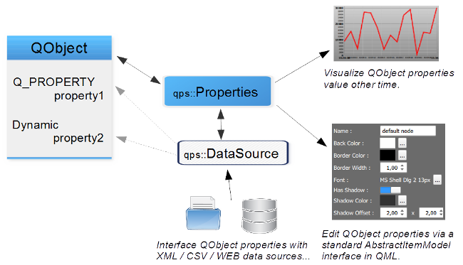
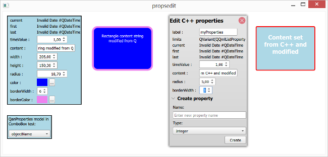
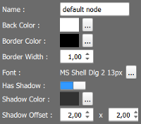
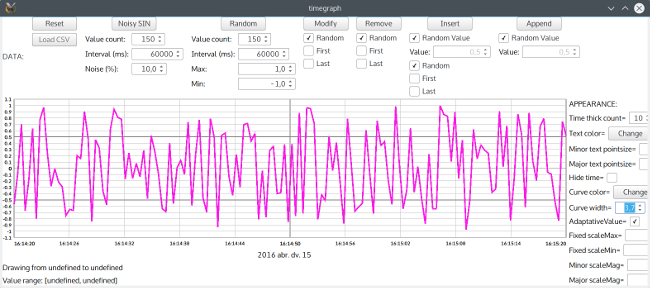

!!! warning "QuickProperties is alpha software" 

QuickProperties
============================
`QuickProperties` is a C++11/Qt/QML library designed to support edition and management of QObject with static and dynamic properties. QuickProperties can also expose container of QObject to Qt AbstractItemModel that are easy to reuse as a model in complex QML view (mainly ListView with custom delegates).

`QuickProperties` provide a consistent data model based on QObject to expose complex objects with properties of multiple types in QML UIs. QuickProperties (QPS) main concepts are:
- **Properties:** properties are a set of standard Qt static and dynamic properties in a QObject.

- **Timed properties:** extend previous concept with date/time support; all property values could be modified and retrieved over time allowing the user to display a timegraph of values for specific properties. Timed properties can eventually be visualized with [QuickTimeGraph](https://github.com/cneben/QuickTimeGraph) or Qt Chart.

- **DataSource:** either a synchronous or asynchronous source of data for timed properties (actually, an XML or CSV file, or a more advanced wrapper such as in to the Y!F  HTTP stock sample). QuickProperties can "bind" an asynchronous data source fetching data from the Web on a class exposing a Q_PROPERTY( real p ): http://www.destrat.io/quickproperties/doc/FIXME

- **Qt Item Model interface:** QuickProperties can expose containers (either QVector or QList) of QObject in a standard Qt Item Model interface, allowing visualization and edition of properties directly in existing QML components. qps::ContainerListModel also has dedicated code to manage standard container of smart pointer containing QObject pointer, for example you can expose a type such as QVector<std::shared_ptr<QObject>> directly as a QAbstractListModel useable in a QML ListView *model* property: http://www.destrat.io/quickproperties/doc/FIXME
More informations available on project homepage: http://www.destrat.io/quickproperties

QuickProperties is primarily developed with Qt >= 5.6 with MSVC2015 and g++5.3

QuickProperties Reference documentation: http://www.destrat.io/quickproperties/doc/index.html

QuickProperties is still _early alpha_, contact benoit@destrat.io if you need specific features or non GPL licencing.

## Dependencies

- **Google Test**: Google Test GitHub: https://github.com/google/googletest/

## Screenshots

License
=======
QuickProperties is distributed under the GNU Lesser General Public Licence v3 LGPLv3.

[LGPLv3](https://github.com/cneben/QuickProperties/blob/master/lgpl.txt)

Copyright (c) 2016 Delia Stratégie

